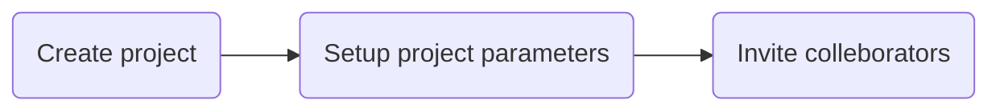
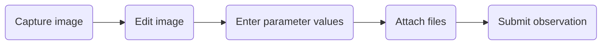

# ManuScrape Native
ManuScrape is a solution for managing large amounts of observations (images mapped to custom defined project parameters), including tools to collect, edit, enrich and export. There are two actors: the project manager, and the collaborator (can only submit observations). This is the general idea:

Project manager (using web app):

Collaborator (using native app):

## Installation on Windows
Before you start installing, you need to decide where you want to put your data. As of now you can temporarily use [manuscrape.org](https://manuscrape.org) for free, and it is also the default in the signup flow.

You can download a compiled windows installer, that will either install or update ManuScrape to the desired version. The latest .exe installer can be found [here](https://github.com/nikobojs/manuscrape_electron/releases).
 
 

## Features
_Video introduction will maybe come out soon!_
 
 

## Bug reports / feature requests
After the launch of v1.0.0, we intend to use GitHub Issues for all development tasks. If you experience bugs or need features added or refactored, please [submit an issue](https://github.com/nikobojs/manuscrape_electron/issues), preferably in english.
 
 

## Contribute to the code
You are most welcome to contribute to the project in any way. Except donations. For now.

#### Repository overview:
This repo is an Electron app tested continuously on Windows 11 and a couple Linux distributions. The app provides some client-side native tools that talks with the api of the online backend app. [Here is the backend repo](https://github.com/nikobojs/manuscrape_nuxt). These to repositories follows compatability with git tags (eg. `v0.9.2` client works with `v0.9.2` api).
 
 

#### Git conventions
Not strict in any way. We'll always figure it out so you do stuff the way you think it works best. However pull requests (into "unstable" branch) on feature branches is preferred.
 
 

#### Setup on Linux or Mac:
1. Install Electron repository:
	1. `git clone https://github.com/nikobojs/manuscrape_electron`
	2. `cd manuscrape_electron`
	3. `npm install`
	4. `npm pyinstall`
	5. `npm pyfreeze`
2. [Install ManuScrape Nuxt repository](https://github.com/nikobojs/manuscrape_nuxt)
5. Start Nuxt app: `cd manuscrape_nuxt && yarn dev`
6. Start Electron app: `cd manuscrape_electron && npm start`
 
 

#### Setup on Windows:
_NOTE: Development ennvironment for windows is not actively maintained or tested_  
It is possible to setup on windows, as the app compiles on windows. The tricky part here is `virtualenv` from PyPi, which is the virtual python environment that incapsules a part of the scrollshot feature. `virtualenv` seems inconsistent in what paths it creates on windows on initialization. To compensate for that, there are two replacement npm scripts that might make it fix a python path bug for you: `npm run pyinstall-win` and `npm run pyfreeze-win`. If you know a better fix, please submit an issue!